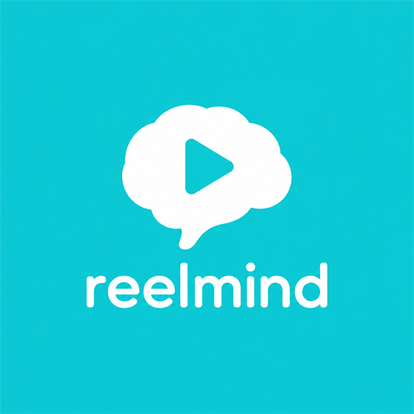
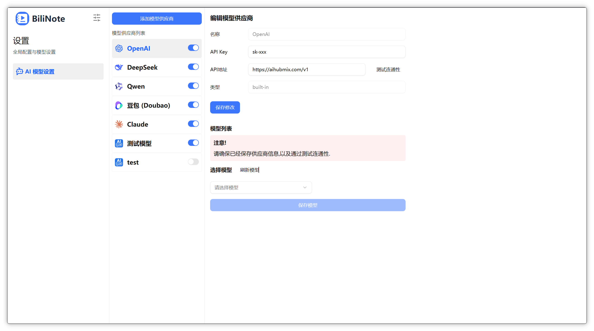
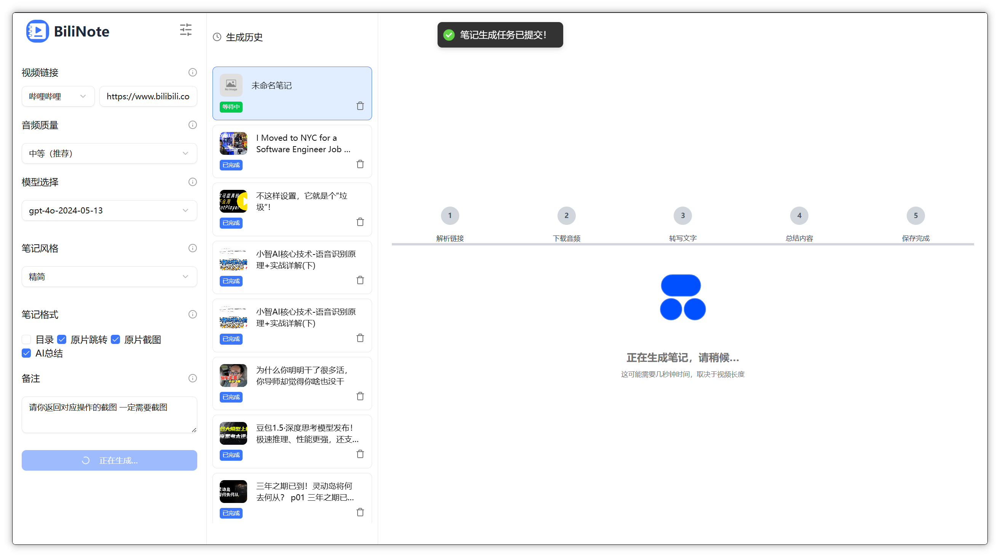

<p align="center">
  
</p>

<h1 align="center">FastRead</h1>

<p align="center">
  <strong>NotebookLM 式学术阅读报告 + 可审计证据层</strong>
</p>

<p align="center">
  FastRead 优先解决“如何读懂一篇论文”：导入 PDF、围绕关键问题解释方法与贡献、保留页码引用、支持 300 字个人总结和持续追问；联网核验作为证据层保留。
</p>

<p align="center">
  
  
  
  
  
</p>

---

## 目录

- [项目亮点](#项目亮点)
- [界面预览](#界面预览)
- [技术栈](#技术栈)
- [快速开始](#快速开始)
- [使用流程](#使用流程)
- [配置说明](#配置说明)
- [浏览器扩展](#浏览器扩展)
- [常见问题](#常见问题)
- [项目结构](#项目结构)
- [路线图](#路线图)
- [许可证](#许可证)

## 项目亮点

FastRead 当前的 P0 是完成一篇论文的可审计阅读闭环：

```text
PDF / 论文 URL -> 分页原文 -> 关键问题报告 -> 方法与贡献 -> 300 字总结 -> 带页码持续追问
```

- **NotebookLM 式报告**：固定覆盖研究问题、方法过程、主要贡献、实验/证据和局限，避免零散 bullet 堆砌。
- **结构化引用**：报告引用只有在分页原文或已抽取核验证据中匹配成功才会保留。
- **学术身份 Gate**：区分正式论文、预印本、身份不完整和撤稿；四大安全顶会须由抓取到的官方出版记录对齐标题、作者、年份、venue 和 DOI/官方 URL，用户填写的字段不能直接过 Gate。
- **个人总结**：AI 报告之外单独保存用户自己的 300 字内总结。
- **持续追问**：论文分页原文、阅读报告和核验证据共同进入任务问答上下文，来源显示页码。

联网核验仍是报告的证据层，规则不降级：

当前核验链路：

```text
输入文本/URL/已有任务 -> 主张原子化 -> 多查询检索 -> 正文/PDF 抓取 -> 信源验真 -> 证据抽取 -> 规则判定 -> 审计报告
```

- **主张原子化**：从输入文本、URL 正文或已有视频任务中提取可核验的 atomic claims。
- **多源联网检索**：支持 Brave、Bing Academic、Bing CN、Baidu 等搜索源和质量补充检索。
- **正文证据优先**：搜索摘要只作为召回线索；`supported` 必须来自抓取到的网页/PDF 正文证据。
- **信源验真**：输出来源等级、canonical URL、publisher、author、published date、content hash、independence group、redirect chain 和风险标记。
- **反操纵防线**：识别伪权威域名、canonical/redirect 异常、提示词注入、内容农场、榜单软文、复制转载和缺失来源身份。
- **可恢复任务**：持久化 claim 级中间产物，rerun 默认只重试失败或未完成的 web 阶段。
- **缓存与审计**：SERP、snapshot、evidence 缓存会记录 hit/miss，方便复查任务为什么得到某个结论。
- **规则判定**：最终 verdict 来自规则证据矩阵，不允许 LLM 自由判断覆盖证据。
- **旧功能保留**：Markdown、思维导图、知识卡片、收藏和问答仍可作为核验前后的辅助工作区。

## 界面预览

<p align="center">
  
</p>

<p align="center">
  
</p>

<p align="center">
  
</p>

## 技术栈

| 模块 | 技术 |
| --- | --- |
| Web 前端 | React 19、Vite、TypeScript、Tailwind CSS、Radix UI、Zustand、Markmap |
| 后端服务 | Python、FastAPI、SQLAlchemy、SQLite、Uvicorn |
| 浏览器扩展 | Vue 3、Vite、WebExtension MV3、UnoCSS |
| 桌面端预留 | Tauri 2 |
| AI 与转写 | OpenAI Compatible API、DeepSeek、Qwen、faster-whisper、bcut、Groq |
| 部署 | 本地 Windows 启动脚本、可选 Docker Compose/Nginx |

## 快速开始

### 给非技术人员

Windows 上只保留根目录一个入口：

```text
run.bat           启动本地后端和前端
run.bat --status  查看服务状态和健康检查
run.bat --stop    停止本地前后端进程
run.bat --check   检查本地依赖
```

第一次启动前需要准备好 `backend\.venv` 和 `reel-mind-frontend\node_modules`。详细说明见 [笨蛋部署说明](./DEPLOYMENT.md)。

### 方式一：本地脚本启动（推荐）

Windows 用户优先双击根目录的 `run.bat`。这是唯一保留的本地入口，默认不需要 Docker。

默认访问地址：

```text
http://127.0.0.1:3015/
```

后端 API：

```text
http://127.0.0.1:8483/api/sys_check
http://127.0.0.1:8483/api/sys_health
```

如果只想启动但不自动打开浏览器：

```powershell
.\run.bat --no-open
```

脚本会自动：

- 读取或创建本地 `.env`
- 检查后端虚拟环境和前端依赖
- 启动后端和前端开发服务
- 通过健康检查后打开浏览器

首次运行前如果依赖不存在，先安装：

#### 准备后端

```powershell
cd backend
python -m venv .venv
.\.venv\Scripts\python.exe -m pip install -r requirements.txt
cd ..
```

#### 准备前端

```powershell
cd reel-mind-frontend
corepack enable
pnpm install
cd ..
```

### 方式二：手动源码开发启动

如果需要分别调试后端或前端，可以手动启动。默认仍建议使用和 `run.bat` 一致的本地端口：

- 后端：`http://127.0.0.1:8483`
- 前端：`http://127.0.0.1:3015`

启动后端：

```powershell
cd backend
.\.venv\Scripts\python.exe main.py
```

启动前端：

```powershell
cd reel-mind-frontend
$env:VITE_API_BASE_URL="/api"
pnpm run dev -- --host 0.0.0.0 --port 3015
```

后端根路径不是页面入口，直接访问 `http://127.0.0.1:8483` 返回 `{"detail":"Not Found"}` 属于正常现象。

### 可选：Docker 部署路径

Docker 仅作为可选部署或高级演示路径保留，不再是默认推荐启动方式。确实需要容器部署时，直接使用 Docker Compose：

```powershell
docker compose up -d --build
```

Docker 模式下，后端通过 Nginx 的 `3015` 端口访问：

```text
Web:      http://127.0.0.1:3015/
API:      http://127.0.0.1:3015/api/...
健康检查: http://127.0.0.1:3015/api/sys_check
```

查看服务状态和日志：

```powershell
docker compose ps
docker compose logs --tail=80 backend
```

停止 Docker 服务：

```powershell
docker compose down
```

如果本地还残留旧容器名，执行一次完整重建即可切换到 `reel-mind-backend`、`reel-mind-frontend`、`reel-mind-nginx`：

```powershell
docker compose down
docker compose up -d --build
```

## 测试

后端测试依赖单独放在 `backend/requirements-dev.txt`。首次配置测试环境：

```powershell
cd backend
.\.venv\Scripts\python.exe -m pip install -r requirements-dev.txt
cd ..
```

从仓库根目录运行后端测试：

```powershell
backend\.venv\Scripts\python.exe -m pytest
```

前端和扩展构建检查：

```powershell
cd reel-mind-frontend
pnpm run build

cd ..\reel-mind-extension
pnpm run build
```

## 使用流程

### 联网核验优先流程

1. 打开 Web 前端。
2. 输入待核实文本、URL 或选择已有任务。
3. 点击发起联网核实。
4. 等待任务完成主张提取、检索、抓取、证据抽取和交叉判定。
5. 在报告中查看整体状态、claim verdict、confidence、正文证据、来源等级、风险标记和 audit。
6. 对失败或不完整的任务点击 rerun；默认只重试失败/未完成 web 阶段。

### 旧视频笔记流程

视频输入仍可使用，例如：

```text
https://www.douyin.com/jingxuan?modal_id=7633777410067926322
```

生成后可继续从旧笔记发起联网核实。旧 Markdown、思维导图、知识卡片和 AI 问答是 secondary artifacts，不能替代联网核验报告。

生成结果默认写入：

```text
backend/note_results/
```

常见结果文件：

```text
{task_id}.json
{task_id}.status.json
{task_id}_audio.json
{task_id}_transcript.json
{task_id}_markdown.md
{task_id}_markdown.status.json
_verification/{task_id}/claims/{claim_id}.json
_verification/_cache/serp/*.json
_verification/_cache/snapshot/*.json
_verification/_cache/evidence/*.json
```

## 配置说明

主要配置位于根目录 `.env`。

| 变量 | 说明 | 示例 |
| --- | --- | --- |
| `APP_PORT` | 可选 Docker/Nginx 对外端口 | `3015` |
| `BACKEND_HOST` | 后端监听地址 | `0.0.0.0` |
| `BACKEND_PORT` | 后端服务端口 | `8483` |
| `VITE_API_BASE_URL` | 前端请求后端 API 地址 | `/api` 或 `http://127.0.0.1:8483/api` |
| `TRANSCRIBER_TYPE` | 转写器类型 | `bcut`、`fast-whisper`、`groq` |
| `WHISPER_MODEL_SIZE` | Whisper 模型大小 | `tiny`、`base`、`small`、`medium` |
| `NOTE_OUTPUT_DIR` | 任务结果、核验产物和缓存目录 | `note_results` |
| `FFMPEG_BIN_PATH` | FFmpeg 可执行文件路径 | 留空则使用系统 PATH |
| `ONLINE_VERIFY_SEARCH_PROVIDER` | 联网核验主搜索源 | `brave`、`bing_academic`、`bing_cn` |
| `ONLINE_VERIFY_SEARCH_FALLBACK_PROVIDERS` | 联网核验兜底搜索源 | `bing_academic,bing_cn,baidu` |
| `BRAVE_SEARCH_API_KEY` | Brave Search API Key | 使用 Brave 搜索源时填写 |
| `BRAVE_SEARCH_COUNTRY` | Brave 搜索国家/地区 | `CN` |
| `BRAVE_SEARCH_LANG` | Brave 搜索语言 | `zh-hans` |
| `BRAVE_SEARCH_UI_LANG` | Brave 搜索界面语言 | `zh-CN` |

推荐开发期使用：

```env
TRANSCRIBER_TYPE=bcut
WHISPER_MODEL_SIZE=tiny
```

首次触发 `fast-whisper tiny` 时会下载模型到：

```text
backend/models/whisper/whisper-tiny
```

## 浏览器扩展

扩展目录位于 `reel-mind-extension/`。当前可发布范围是 verification-first popup：从当前标签页 URL 或粘贴文本创建 ReelMind 联网核实任务，并打开 Web 工作台报告。

安装依赖：

```powershell
cd reel-mind-extension
pnpm install
```

开发构建：

```powershell
pnpm dev
```

生产构建：

```powershell
pnpm build
```

构建产物会输出到：

```text
reel-mind-extension/extension/
```

当前 manifest 只声明 popup；`background`、`contentScripts`、`options` 和 `sidepanel` 仍是后续完整扩展草稿，不属于当前发布产物。扩展默认连接：

```text
http://127.0.0.1:8483
```

创建任务接口：

```text
POST http://127.0.0.1:8483/api/verification_tasks
```

抖音 Cookie 同步已降级为输入诊断，供旧视频链路排障。抖音详情接口依赖有效 Cookie；如果视频详情为空、提示需要登录或下载失败，优先检查：

```text
http://127.0.0.1:8483/api/downloader_cookie_status/douyin
```

诊断同步方式：

1. 在浏览器中打开抖音精选并登录。
2. 打开 Reel Mind 浏览器扩展。
3. 点击 Cookie 状态块中的「同步 Cookie」。
4. 回到 Web 设置页刷新状态。

## 常见问题

### 页面一直显示后端初始化中

检查前端是否指向了正确后端：

```powershell
$env:VITE_API_BASE_URL="http://127.0.0.1:8483/api"
```

修改后需要重启前端服务，并在浏览器中按 `Ctrl + F5` 强制刷新。

### 生成失败并提示第三方服务异常

通常是在线转写服务波动。当前后端会自动尝试回退到 `fast-whisper`。如果仍失败，检查：

- FFmpeg 是否安装并加入 PATH
- `backend/models/whisper/whisper-tiny` 是否下载完整
- 后端日志中的具体异常
- 抖音 Cookie 是否缺失或过期

### 生成成功但笔记内容很少

部分知识视频主要依赖画面文字或字幕，音频里没有完整讲解。当前后端会把标题、文案、描述和话题标签合并进上下文，但画面文字较多的视频仍需要后续增强 OCR 或视频理解能力。

### 可选 Docker 服务启动后无法访问

确认端口没有被占用，并查看服务状态：

```powershell
docker compose ps
docker compose logs --tail=80
```

Docker 正常时，宿主机健康检查应返回 `{"code":0,"msg":"success","data":null}`：

```powershell
Invoke-RestMethod http://127.0.0.1:3015/api/sys_check
```

## 项目结构

```text
.
├── backend/               # FastAPI 后端、下载器、转写、AI 总结、数据库
├── reel-mind-frontend/     # React Web 前端
├── reel-mind-extension/    # 浏览器扩展
├── doc/                   # 文档图片和产品资料
├── docs/                  # 产品需求文档
├── nginx/                 # Docker 反向代理配置
├── docker-compose.yml     # Docker Compose 部署
├── OPEN_ME_FIRST.md       # 给非技术人员的最短说明
├── run.bat                # 唯一 Windows 本地入口：启动/检查/状态/停止
├── pytest.ini             # 后端 pytest 配置
└── DEPLOYMENT.md          # 面向非技术人员的部署说明
```

## 路线图

- [x] Verification-first 任务 API
- [x] Claim 级中间产物持久化
- [x] SERP、snapshot、evidence 缓存和 cache audit
- [x] 来源等级、独立性、canonical、content hash 和 redirect chain audit
- [x] 伪权威、canonical/redirect 异常、prompt injection、内容农场和复制转载风险
- [x] GEO/language differential retrieval 骨架和 `geo_disagreement`
- [x] 旧视频笔记、Markdown、思维导图、知识卡片、收藏和问答兼容保留
- [ ] Source registry 外置为可维护文件或表
- [ ] 更强 publisher/author/date 抽取与来源身份评分
- [ ] PDF page offsets 和证据定位增强
- [ ] 单 claim / 单 stage 更细粒度 rerun
- [ ] 前端报告强化筛选：高风险、证据不足、refuted、data void、domain、source tier
- [ ] 浏览器扩展完全转为「用 ReelMind 联网核实此内容」
- [ ] 更完整的端到端核验回归测试

## 相关文档

- [产品需求文档](./docs/FASTREAD_REQUIREMENTS.md)
- [部署说明](./DEPLOYMENT.md)

## 许可证

本项目基于 [MIT License](./LICENSE) 开源。

抖音下载相关代码参考了 [Evil0ctal/Douyin_TikTok_Download_API](https://github.com/Evil0ctal/Douyin_TikTok_Download_API)。
