# ReelMind PRD

| PRD 审核人 | 刘浩宇 |
| --- | --- |
| 重要性 | 高 |
| 紧迫性 | 中 |
| 需求方 | 产品团队 |
| PRD 编写人 | 刘浩宇 |
| PRD 提交日期 | 2026/05/13 |

## PRD 修改记录

| 变更时间 | 变更内容 | 变更提出部门与理由 | 修改人 | 审核人 | 版本号 |
| --- | --- | --- | --- | --- | --- |
| 2026/05/13 | 初始版本 | — | 刘浩宇 | 刘浩宇 | v1.0 |

---

## 1、项目背景

### 1.1 业务现状

抖音精选作为抖音旗下的中长视频内容平台，已聚集大量知识类创作者，覆盖科技、人文、商业、技能教学等多个垂直领域。用户在平台内日均消费知识类长视频的时长持续增长，但现有产品能力主要聚焦于"内容消费"环节，缺乏围绕"知识沉淀、体系化学习、学习效果追踪"的闭环工具。

当前，用户在观看知识视频后的常见行为是：点赞收藏 → 收藏夹积压 → 很少二次回顾 → 知识遗忘。平台提供的收藏功能仅解决"标记"问题，未解决"吸收、结构化、复习、关联拓展"等深层学习需求。

### 1.2 面临问题

1. **知识遗忘率高，缺乏有效回顾机制**：用户看完 15-30 分钟的知识视频后，若不进行笔记和回顾，一周后的知识留存率极低。现有收藏夹只是视频链接堆叠，无法触发有效复习。
2. **内容碎片化，难以形成知识体系**：抖音精选上的知识视频由不同创作者在不同时间点产出，主题交叉但缺乏关联。用户很难自主将零散视频组织成连贯的知识结构。
3. **学习无规划，被动消费为主**：大多数用户是"刷到什么学什么"，缺乏基于个人目标的学习路径规划，导致学习深度不足、容易半途而废。
4. **笔记与提取工具与视频场景割裂**：现有通用笔记工具（Notion、飞书文档等）无法与视频时间点绑定，知识提取成本高，回顾时需要重新定位视频片段。

### 1.3 解决思路

本产品定位为**抖音精选的第三方知识管理插件**，以浏览器扩展/小程序形式嵌入用户使用场景，构建"收藏 → 提取 → 总结 → 可视化 → 推荐 → 规划"的完整知识管理闭环。

核心策略：
- **轻量收藏与智能提取**：在观看视频时一键收藏，并自动提取视频字幕、关键知识点、时间戳。
- **AI 驱动的知识加工**：基于大模型对视频内容进行摘要、生成思维导图、制作讲解动画，降低用户整理成本。
- **知识关联与推荐**：分析视频内容的语义关联，自动推荐前置知识和进阶内容，帮助用户填补知识 gaps。
- **学习计划与追踪**：支持用户制定周期性学习计划，结合艾宾浩斯遗忘曲线等学习科学原理，智能推送复习提醒。

### 1.4 决策依据

- **市场需求验证**：NotebookLM、Readwise、Mem.ai 等 AI 知识管理工具在过去两年用户量快速增长，验证了"AI + 知识管理"的产品方向具有明确市场需求。
- **平台内容红利**：抖音精选中长视频内容库持续扩张，知识类内容占比提升，但平台原生工具未能满足深度用户的知识管理诉求，存在第三方工具切入的窗口期。
- **技术可行性成熟**：语音识别（ASR）、大语言模型摘要、知识图谱构建、HTML5 动画生成等关键技术已达到可商用水平，支撑产品核心功能落地。
- **用户行为数据**：中长视频平台的"收藏后回顾率"普遍低于 10%，用户痛点真实且普遍。

---

## 2、需求基本情况

| 要素 | 内容 |
| --- | --- |
| **需求提出人** | 产品团队（基于对抖音精选用户知识管理痛点的洞察） |
| **功能使用人** | 抖音精选知识类视频的深度用户（学生、职场学习者、终身学习者） |
| **受影响人** | 抖音精选平台运营方（用户停留时长、内容消费深度可能变化）；知识类创作者（内容被二次传播和体系化组织的概率提升） |
| **场景描述** | 见下方详细场景 |
| **发生频率** | 日均 1-3 次（每次观看知识视频时） |
| **核心痛点** | 知识视频看完即忘、收藏夹沦为"垃圾堆"、学习缺乏系统性和规划性 |
| **需求价值** | 将碎片化视频消费转化为可持续的个人知识资产积累，提升用户学习效率和留存 |

### 核心场景描述

> 场景六要素：人物、时间、地点、起因、经过、结果

**场景1：观看视频时的即时收藏与提取**

- **人物**：小李，25 岁互联网运营，利用下班后时间在抖音精选学习数据分析知识
- **时间**：工作日晚间 20:00-22:00
- **地点**：家中，使用电脑浏览器访问抖音精选网页版
- **起因**：刷到一个关于"SQL 窗口函数详解"的 20 分钟教学视频，觉得内容 quality 很高
- **经过**：
  1. 小李点击插件图标，将该视频加入"数据分析学习"收藏夹；
  2. 插件自动提取视频字幕和关键时间节点；
  3. 视频播放完毕后，插件弹出摘要卡片，展示核心知识点列表；
  4. 小李选择"生成思维导图"，30 秒后获得一张可视化的知识结构图。
- **结果**：小李无需手动记笔记，已拥有一份结构化的知识卡片，可随时复习。

**场景2：周期性复习与学习计划执行**

- **人物**：小王，30 岁产品经理，正在系统学习 AI 产品知识
- **时间**：周末上午
- **地点**：咖啡厅，使用 iPad 访问抖音精选
- **起因**：上周收藏了 5 个关于"大模型应用产品设计"的视频，但还没有整理
- **经过**：
  1. 插件根据艾宾浩斯遗忘曲线，推送"本周需复习的知识点"提醒；
  2. 小王打开"学习计划"面板，看到本周任务：复习 3 个视频、新学 2 个视频；
  3. 插件自动推荐 2 个前置知识视频（"Transformer 原理入门"）和 2 个进阶视频（"AI Agent 产品设计实战"）；
  4. 小王将推荐视频加入下周学习计划。
- **结果**：小王从"随机刷视频"转变为"有规划地系统性学习"，知识吸收更扎实。

**场景3：知识体系构建与前后置关联**

- **人物**：小张，大三计算机专业学生，正在自学前端开发
- **时间**：学期中，碎片化时间
- **地点**：宿舍/图书馆，手机和电脑切换使用
- **起因**：已收藏了 20+ 个前端相关视频，但感觉知识点零散，不知道学习顺序
- **经过**：
  1. 小张在插件中查看"我的知识图谱"功能；
  2. 插件基于视频内容的语义分析，自动将 20 个视频归类到"HTML/CSS"、"JavaScript 基础"、"React 框架"等主题下；
  3. 图谱中用箭头标示了知识点之间的依赖关系（如"先学 JS 基础，再学 React"）；
  4. 小张发现自己在"CSS 布局"方面有知识缺口，插件推荐了 3 个补漏视频。
- **结果**：小张获得了清晰的学习地图，知道下一步该看什么、缺什么。

---

## 3、商业分析

### 3.1 目标市场与客户分析

| 分析维度 | 内容 |
| --- | --- |
| **目标市场** | 中国在线知识消费用户，聚焦中长视频平台（抖音精选、B站、西瓜视频等）的深度学习者 |
| **市场特征** | 知识内容供给过剩但用户吸收效率低；AI 工具正在重塑知识管理品类；用户对"学完即用"的即时获得感要求提高 |
| **发展趋势** | ① AI 驱动的个性化学习路径规划成为标配 ② 视频内容的知识结构化需求上升 ③ 从"内容消费"到"知识资产沉淀"的用户行为迁移加速 |
| **客户画像** | **核心用户**：22-35 岁一二线城市职场人士/大学生，有明确自我提升诉求，每周在中长视频平台消费知识内容 ≥3 小时，愿意为效率工具付费。**延伸用户**：高中生及考研/考证群体，需要系统性学科知识整理 |
| **客户痛点** | ① 收藏即遗忘，缺乏复习机制 ② 视频内容无法快速提取核心信息 ③ 学习缺乏规划，容易半途而废 ④ 知识点之间孤立，难以形成网络 |
| **卖点提炼** | "让每一条收藏的视频，都真正变成你的知识"——AI 自动提取、结构化、关联推荐、计划追踪，终结'收藏夹吃灰' |

### 3.2 竞品分析

| 分析维度 | 竞品A：NotebookLM | 竞品B：Readwise Reader | 竞品C：B站笔记功能 | 我方产品 |
| --- | --- | --- | --- | --- |
| **目标客户** | 研究者、学生、知识工作者 | 重度阅读者、学习者 | B站知识区用户 | 抖音精选知识视频消费者 |
| **运营推广策略** | Google 生态内嵌、AI 社区口碑传播 | 内容营销、KOL 推荐、 affiliate | 平台功能迭代公告、UP主教学 | 浏览器插件商店、学习类 KOL 合作、抖音精选社区运营 |
| **市场份额** | 快速增长，尤其在学术和研究领域 | 知识管理垂直领域头部 | B站内部渗透率中等 | 尚未进入市场 |
| **核心功能** | AI 对话式学习、音频概述、文档集合分析 | 阅读高亮、自动同步、间隔重复复习 | 视频时间戳笔记、截图、公开分享 | 视频知识提取、思维导图、讲解动画、学习计划、关联推荐 |
| **核心价值** | 降低长篇文档的理解门槛 | 打通阅读→记忆→复习的闭环 | 降低视频做笔记的操作成本 | 将视频消费转化为系统化知识学习 |
| **优势** | Google 品牌背书、AI 能力强、免费 | 阅读同步生态完善、复习算法成熟 | 与视频播放深度集成、零额外成本 | 专注视频场景、AI 可视化（动画/导图）、中文知识内容优化 |
| **劣势** | 仅支持文档/音频输入，不支持视频场景 | 无视频处理能力，依赖文字内容 | 仅支持 B站、无 AI 总结、无学习规划 | 作为新入局者，品牌认知度和用户基数为零|

### 3.3 差异化定位

**核心差异化策略：视频原生 × AI 可视化 × 中文知识优化**

1. **场景差异化**：NotebookLM 专注文档/音频，Readwise 专注文字阅读，B站笔记仅为播放页附属功能。我方是**首个专为中文中长视频知识消费设计的 AI 学习助手**，从视频场景出发而非通用笔记场景。
2. **输出形式差异化**：除文本摘要外，提供**讲解 HTML 动画**和**思维导图**两种可视化知识呈现方式，降低理解门槛，增强记忆效果。
3. **闭环差异化**：不止于"提取和总结"，而是通过**知识图谱关联**和**学习计划追踪**构建完整的学习闭环，帮助用户从"看完"走向"学会"。
4. **内容生态差异化**：深度对接抖音精选知识内容库，利用中文语境下的知识关联数据，提供更精准的前后置推荐。

### 3.4 SaaS 商业模型预估

| 指标 | 预估值 | 说明 |
| --- | --- | --- |
| **目标定价** | 免费版：基础收藏 + 简单摘要；Pro 版：¥15-25/月 或 ¥128-198/年（含 AI 动画、思维导图、无限学习计划、高级推荐） | 参考国内 AI 工具定价区间 |
| **CAC（获客成本）** | ¥20-40 | 主要依赖插件商店自然流量 + KOL 合作 + 内容营销，低销售成本 |
| **LTV（客户生命周期价值）** | ¥300-500 | = ARPU（¥180/年）× 平均留存周期（1.5-2.5 年） |
| **LTV/CAC** | 8-15 | 健康基线 > 3，目标显著高于基线 |
| **目标 Churn Rate** | 月度 5-8%，年度 30-40% | 学习工具类产品的典型流失水平 |
| **回本周期** | 2-4 个月 | CAC / 月 ARPU |

> SaaS 健康基线：LTV/CAC > 3，回本周期 < 12 个月。本产品预估模型健康度良好。

---

## 4、项目收益目标

> 方法论基础：SMART 原则（具体、可衡量、可实现、相关性、有时限）

### 4.1 项目目标

| 目标类型 | 目标描述 | 衡量指标 | 目标值 | 达成时限 |
| --- | --- | --- | --- | --- |
| **核心业务目标** | 验证产品在抖音精选用户中的付费意愿和产品价值 | 付费转化率 | ≥ 3% | 上线后 6 个月 |
| **核心业务目标** | 建立可持续的用户增长和收入模型 | MRR（月度经常性收入） | ≥ ¥50,000 | 上线后 12 个月 |
| **效率目标** | 帮助用户高效消化知识视频内容 | 单视频平均知识提取时间 | 从人工 15 分钟降至 AI 辅助 <1 分钟 | MVP 上线时 |
| **效率目标** | 提升用户知识回顾效率 | 收藏视频七日回访率 | 从行业平均 <10% 提升至 ≥ 35% | 上线后 6 个月 |
| **体验目标** | 提供流畅、无侵入的插件使用体验 | NPS（净推荐值） | ≥ 30 | 上线后 6 个月 |
| **体验目标** | 确保 AI 生成内容的质量可用性 | 知识摘要用户满意度评分 | ≥ 4.0/5.0 | MVP 上线时 |

### 4.2 验收标准

1. **功能完整性**：核心功能模块（收藏管理、知识提取、AI 摘要、思维导图、学习计划）全部可用，主流程无阻断性 Bug。
2. **性能达标**：插件页面加载时间 < 2 秒；AI 摘要生成时间 < 30 秒；思维导图生成时间 < 45 秒。
3. **安全合规**：用户数据加密存储；符合《个人信息保护法》要求；不存储用户视频内容，仅处理元数据和字幕文本。
4. **兼容性**：支持 Chrome、Edge、Safari 主流浏览器最新两个版本；支持抖音精选网页版核心页面。
5. **用户体验**：核心操作流程（收藏 → 提取 → 查看摘要）可在 3 步内完成。

### 4.3 成功标准

> 项目上线后 **6 个月**内，达到以下指标视为成功：

1. **注册用户** ≥ 20,000 人，**DAU** ≥ 2,000 人。
2. **付费订阅用户** ≥ 600 人，月度付费转化率 ≥ 3%。
3. **功能使用率**：收藏功能周使用率 ≥ 40%，AI 摘要功能使用率 ≥ 30%，学习计划功能使用率 ≥ 15%。
4. **用户留存**：次周留存率 ≥ 25%，次月留存率 ≥ 15%。
5. **内容生产**：用户生成的思维导图/动画内容中，≥ 60% 被用户主动保存或分享。

---

## 5、项目方案概述

> 方法论基础：《决胜B端》自顶向下设计思路 — 先全景后细节

### 5.1 核心功能概述

本项目包含以下核心功能模块：

| 序号 | 功能模块 | 功能简述 | 优先级 |
| --- | --- | --- | --- |
| 1 | **视频收藏管理** | 用户创建自定义收藏夹，将抖音精选视频按主题分类收藏，支持标签、备注、时间戳标记 | P0 |
| 2 | **AI 知识提取** | 自动提取视频字幕、识别关键知识点、生成带时间戳的知识卡片 | P0 |
| 3 | **AI 知识总结** | 基于视频内容生成结构化摘要（要点列表、章节概述、核心结论） | P0 |
| 4 | **思维导图生成** | 将视频知识结构自动转化为可交互的思维导图，支持编辑和导出 | P0 |
| 5 | **讲解动画生成** | 基于视频核心知识点生成 HTML5 讲解动画，以可视化方式复述知识要点 | P1 |
| 6 | **知识关联推荐** | 分析视频语义内容，推荐前置知识视频、进阶视频和关联拓展视频 | P1 |
| 7 | **学习计划制定** | 用户自定义学习目标与周期，系统智能排课、推送复习提醒、追踪学习进度 | P1 |
| 8 | **知识图谱视图** | 以图谱形式展示用户收藏视频之间的主题关联和知识依赖关系 | P2 |

### 5.2 方案概述

- **产品方案**：以浏览器扩展（Chrome/Edge/Safari）为主要形态，嵌入抖音精选网页版使用场景，提供"边看边收、边收边学"的无缝体验。未来可扩展为独立 Web 应用和移动端小程序。
- **技术方案**：前端采用浏览器 Extension Manifest V3 架构；后端基于微服务架构，核心依赖大语言模型（LLM）API 进行内容理解、摘要生成和知识图谱构建；视频字幕通过抖音精选页面 DOM 解析或 ASR 接口获取。
- **运营方案**：初期通过浏览器插件商店自然流量获客，联合学习类 KOL 进行"知识管理方法论"内容营销；中期推出"学习打卡挑战"等社区化运营活动提升留存；后期探索与知识类创作者的分成合作模式。

### 5.3 MVP 范围

> B端 MVP 原则：必须支撑核心业务流程闭环，不是"最简单的版本"

**MVP 包含的功能：**

| 功能 | 包含理由 |
| --- | --- |
| 视频收藏管理（基础版） | 核心入口，没有收藏就没有后续所有功能 |
| AI 知识提取 + 文本摘要 | 核心价值主张，解决"看完即忘"的首要痛点 |
| 思维导图生成（基础版） | 差异化卖点，可视化是用户可感知的产品价值 |
| 基础收藏夹分类 | 支持最基本的知识体系组织 |

**MVP 暂不包含的功能：**

| 功能 | 延后理由 |
| --- | --- |
| 讲解 HTML 动画生成 | 技术复杂度高，生成质量和性能需要更多时间打磨；MVP 阶段可用文本摘要+思维导图替代核心价值 |
| 学习计划与复习提醒 | 需要用户积累一定量的收藏数据后才能体现价值；且涉及推送机制，合规和开发成本较高 |
| 知识关联推荐 | 依赖大规模内容语义分析和知识图谱构建，冷启动阶段数据不足，推荐质量难以保证 |
| 知识图谱视图 | 属于进阶可视化功能，MVP 阶段用收藏夹层级结构即可满足基础分类需求 |

**核心验证假设：**

1. **价值假设**：抖音精选用户愿意为"AI 自动提取视频知识点并生成思维导图"这一功能付费。
2. **留存假设**：提供结构化知识输出（摘要+导图）能显著提升用户对收藏内容的回访率。
3. **技术假设**：基于现有大模型 API 和抖音精选公开字幕数据，能够以可接受的成本和延迟生成高质量的知识摘要。

---

## 6、项目范围

### 6.1 涉及系统

| 系统名称 | 关系类型 | 影响描述 | 责任方 |
| --- | --- | --- | --- |
| **ReelMind**（本系统） | 主体 | 新建浏览器插件 + 后端服务 | 产品团队 |
| **抖音精选网页版** | 数据来源 & 宿主平台 | 插件嵌入抖音精选页面运行，需解析页面 DOM 获取视频信息；依赖平台视频播放器和字幕数据 | 字节跳动（平台方），我方无控制权|
| **大语言模型服务**（如 OpenAI/Claude/国产大模型） | 外部 AI 能力提供方 | 调用 API 进行内容摘要、知识提取、思维导图数据生成、推荐逻辑 | 具体模型服务商待确定 |
| **用户浏览器** | 运行环境 | 插件在 Chrome/Edge/Safari 中运行，需兼容 Manifest V3 规范 | 用户端 |
| **云存储/数据库服务** | 基础设施 | 存储用户收藏数据、生成的知识卡片、学习记录等 | 产品团队 |
| **支付平台** | 外部服务 | 处理 Pro 版订阅付费（微信/支付宝/Stripe 等） | [TODO: 具体支付服务商待确定] |

### 6.2 影响范围

- **用户影响**：抖音精选上主动学习类用户（知识视频消费者）将获得新的知识管理工具；非目标用户不受影响。
- **流程影响**：用户使用抖音精选的"收藏"行为将被本插件增强（插件层面替代或补充原生收藏），但**不改变**抖音精选平台本身的任何业务流程。
- **数据影响**：需获取并存储视频元数据（标题、作者、链接、封面）；用户知识提取结果、思维导图数据、学习记录等新建数据模型；不涉及历史数据迁移（0-1 新产品）。
- **上下游影响**：
  - 上游：依赖抖音精选页面结构的稳定性，若平台改版可能影响插件功能；
  - 下游：生成的思维导图/摘要可导出为图片/Markdown/HTML，供用户在 Notion/飞书/微信等第三方工具使用。

### 6.3 不在本期范围内

1. **移动端 App 原生开发**：本期仅覆盖浏览器插件形态，抖音精选 App 内嵌功能不在范围内（需平台方开放接口，短期内不可行）。
2. **视频内容下载或离线播放**：本产品仅处理视频元数据和字幕文本，不提供视频下载、缓存或离线播放功能，避免版权和合规风险。
3. **社交/社区功能**：本期不包含用户间的收藏夹共享、评论、点赞等社交功能，聚焦于个人知识管理。
4. **UGC 内容上传**：用户不能自主上传视频文件让插件分析，仅支持分析抖音精选平台内已有视频。
5. **多平台支持（B站/YouTube 等）**：首期仅对接抖音精选网页版，其他视频平台适配列入后续迭代规划。

---

## 7、项目风险

### 7.1 前提假设

| 编号 | 假设内容 | 如果假设不成立的影响 |
| --- | --- | --- |
| A1 | 抖音精选网页版在 MVP 开发周期内不发生导致插件失效的重大页面重构 | 插件无法正常解析视频信息，需紧急适配修复，影响开发进度 |
| A2 | 目标用户群体中有足够比例愿意为 AI 知识管理功能付费（付费转化率 ≥ 3%） | 商业模式不成立，需调整定价策略或转向纯免费+广告模式 |
| A3 | 大语言模型 API 在中文视频字幕理解、摘要生成上的质量达到可用水平（准确率 ≥ 80%） | AI 生成内容质量差，用户满意度低，产品核心卖点失效 |
| A4 | 抖音精选允许第三方浏览器插件以非侵入方式访问其公开页面数据 | 若平台采取反插件措施或封禁策略，产品形态需根本调整 |

### 7.2 约束条件

| 编号 | 约束描述 | 对设计的影响 |
| --- | --- | --- |
| C1 | 浏览器插件需遵循 Chrome Extension Manifest V3 规范，Service Worker 有生命周期限制 | 后台持续运行能力受限，学习计划推送等定时任务需通过外部服务器触发 |
| C2 | 无法获得抖音精选官方 API 授权，只能通过页面 DOM 解析获取视频信息 | 数据获取方式脆弱，页面改版即可能失效；需设计优雅的降级方案 |
| C3 | AI 功能依赖外部大模型 API，存在调用成本和 token 限制 | 需设计用量控制策略（如免费用户限次、Pro 用户包月额度），避免成本失控 |
| C4 | 《个人信息保护法》和浏览器商店隐私政策要求 | 用户数据必须加密存储，隐私政策必须透明，不得过度收集数据 |

### 7.3 风险清单

| 编号 | 风险类别 | 风险描述 | 发生概率 | 影响程度 | 应对方案 |
| --- | --- | --- | --- | --- | --- |
| R1 | 产品风险 | 抖音精选页面结构频繁改版，导致插件解析逻辑频繁失效 | 中 | 高 | ① 抽象解析层，封装 DOM 选择器，降低改动范围 ② 建立页面结构监控告警 ③ 与官方沟通探索合作可能性 ④ 预留快速发布通道，缩短修复周期 |
| R2 | 产品风险 | 竞品（抖音精选官方或 NotebookLM 等）推出同类功能，市场窗口关闭 | 中 | 高 | ① 聚焦差异化功能（讲解动画、学习计划）快速建立认知 ② 建立用户数据壁垒（收藏体系和学习记录）提高迁移成本 ③ 与知识类创作者建立独家合作 |
| R3 | 技术风险 | 大模型 API 调用成本过高或服务质量不稳定（延迟高、准确率低） | 中 | 高 | ① 接入多家模型供应商（OpenAI/Claude/国产模型），实现自动降级切换 ② 对高频请求设计缓存机制 ③ 建立输出质量评估和反馈闭环，持续优化 prompt |
| R4 | 合规风险 | 抖音精选或字节跳动认定插件违反平台规则，采取法律或技术反制措施 | 低 | 极高 | ① 严格遵守 robots.txt 和平台条款，不做自动化爬虫 ② 仅处理用户主动触发行为的数据 ③ 咨询法务团队，确保产品形态合规 ④ 准备 B 方案（转向独立 Web 应用，用户手动导入视频链接） |
| R5 | 运营风险 | 用户付费意愿低于预期，Freemium 模式难以跑通 | 中 | 中 | ① MVP 阶段重点验证付费转化率 ② 准备多种 monetization 备选方案（广告、创作者分成、企业版） ③ 通过 NPS 调研持续优化价值感知 |
| R6 | 技术风险 | 插件在部分用户浏览器中因权限设置、安全策略无法正常运行 | 中 | 中 | ① 提供详细的安装和权限配置引导 ② 建立常见问题 FAQ 和自动诊断工具 ③ 支持主流浏览器兼容性测试覆盖 |
| R7 | 产品风险 | AI 生成的知识摘要/思维导图质量不稳定，用户信任度下降 | 中 | 中 | ① 设计"一键重生成"和手动编辑功能 ② 引入用户反馈机制（👍/👎），用于模型优化 ③ 对低置信度内容标注"AI 生成，建议核对" |

---

## 8、术语和缩略语

| 术语/缩略语 | 全称 | 定义说明 |
| --- | --- | --- |
| **PRD** | Product Requirements Document | 产品需求文档 |
| **MVP** | Minimum Viable Product | 最小可行产品，指用最低成本验证核心假设的产品版本 |
| **DAU** | Daily Active Users | 日活跃用户数 |
| **MRR** | Monthly Recurring Revenue | 月度经常性收入 |
| **CAC** | Customer Acquisition Cost | 客户获取成本 |
| **LTV** | Lifetime Value | 客户生命周期价值 |
| **NPS** | Net Promoter Score | 净推荐值，衡量用户满意度和忠诚度的指标 |
| **Churn Rate** | — | 流失率，指在一定周期内停止使用产品的用户比例 |
| **ARPU** | Average Revenue Per User | 每用户平均收入 |
| **ASR** | Automatic Speech Recognition | 自动语音识别，将语音转换为文本的技术 |
| **LLM** | Large Language Model | 大语言模型，用于自然语言理解和生成 |
| **DOM** | Document Object Model | 文档对象模型，浏览器解析 HTML 后的结构化表示 |
| **Manifest V3** | — | Chrome 浏览器扩展的第三代清单规范 |
| **Freemium** | Free + Premium | 免费增值模式，基础功能免费、高级功能付费 |
| **HTML5 动画** | — | 基于 HTML5/CSS/JavaScript 生成的网页端动态可视化内容 |
| **艾宾浩斯遗忘曲线** | — | 描述人类大脑对新事物遗忘规律的数学模型，用于指导复习节奏 |
| **TODO** | — | 待办事项，本文档中表示需要后续补充或确认的内容 |

## 9、参考文献和引用文档

| 文档名称 | 版本 | 链接/位置 | 说明 |
| --- | --- | --- | --- |
| Chrome Extension Manifest V3 开发文档 | 最新 | https://developer.chrome.com/docs/extensions/mv3/intro/ | 浏览器插件开发技术规范 |
| 《个人信息保护法》 | 2021 年 11 月施行 | — | 产品合规法律依据 |
| NotebookLM 产品官网 | — | https://notebooklm.google.com/ | 竞品参考 |
| Readwise 产品文档 | — | https://readwise.io/ | 竞品参考 |

---

## 10、功能需求

### 10.1 产品框架概述

#### 10.1.1 应用架构图

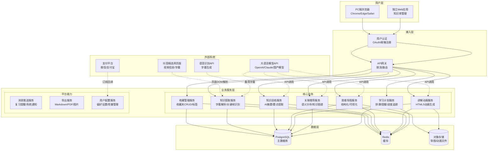

#### 10.1.2 数据模型图

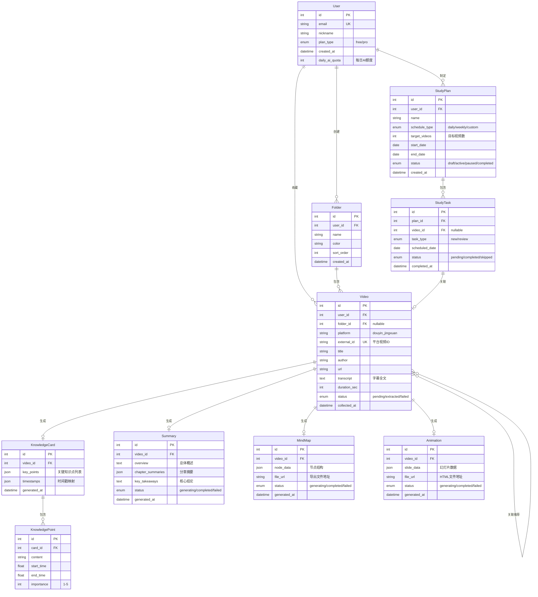

**实体说明补充表：**

| 实体 | 关键属性说明 | 业务规则 |
| --- | --- | --- |
| **User** | `plan_type` 区分免费/付费；`daily_ai_quota` 控制每日 AI 调用上限 | 免费用户每日 AI 生成额度为 5 次，Pro 用户无限制 |
| **Video** | `external_id` 为平台视频唯一标识；`status` 跟踪提取状态 | 同一用户不能重复收藏同一视频；字幕文本最大存储 50KB |
| **KnowledgeCard** | `key_points` 存储结构化知识点；`timestamps` 映射知识点到视频时间 | 每个视频仅生成一张知识卡片，提取失败时可重试 |
| **Summary** | `chapter_summaries` 按视频段落拆分摘要 | 生成中状态不可编辑；失败时保留错误原因 |
| **MindMap/Animation** | `node_data/slide_data` 存储生成结果的结构化数据 | 生成成功后 7 天内可重新导出；超出需重新生成 |
| **StudyPlan** | `schedule_type` 决定任务排布逻辑 | 活跃计划最多同时存在 3 个；已完成计划可归档 |

#### 10.1.3 核心业务流程图

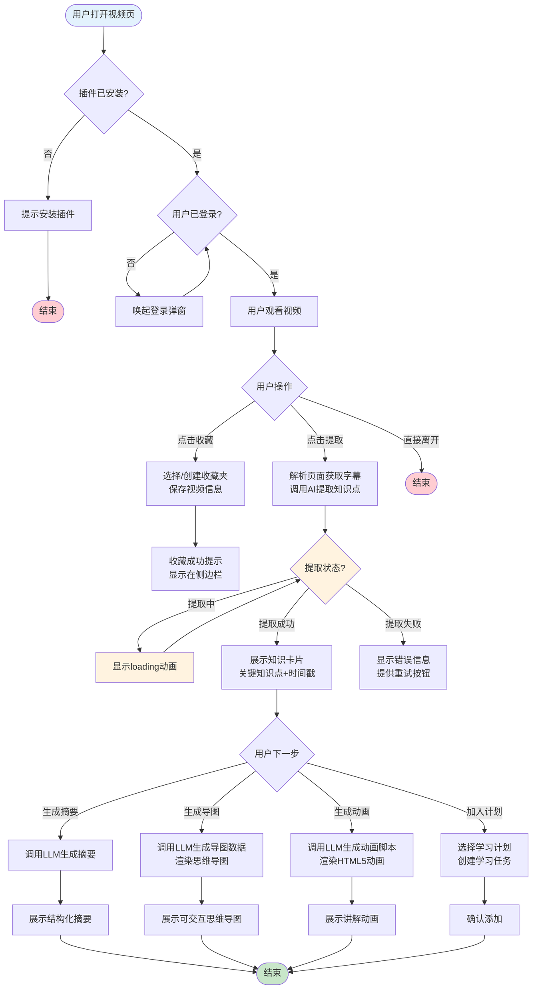

#### 10.1.4 状态机图

**视频知识提取状态机：**

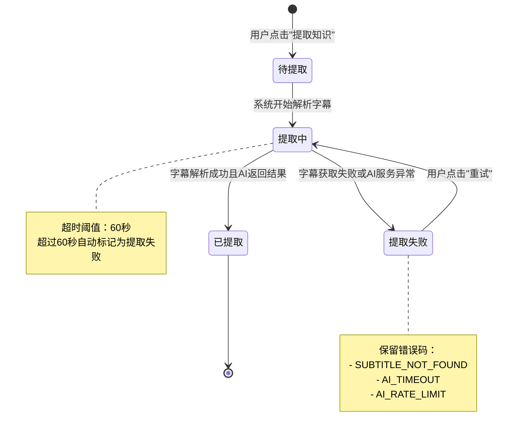

**学习计划状态机：**

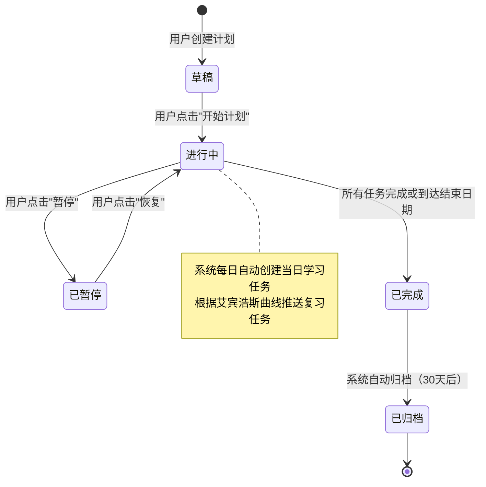

**状态转换明细表：**

| 当前状态 | 触发事件 | 目标状态 | 操作角色 | 备注 |
| --- | --- | --- | --- | --- |
| 待提取 | 用户点击"提取知识" | 提取中 | 用户 | 系统异步调用 AI 服务 |
| 提取中 | AI 返回成功结果 | 已提取 | 系统 | 生成知识卡片和关键知识点 |
| 提取中 | 超时或 AI 服务异常 | 提取失败 | 系统 | 记录具体错误码 |
| 提取失败 | 用户点击"重试" | 提取中 | 用户 | 最多允许 3 次重试 |
| 草稿 | 用户点击"开始计划" | 进行中 | 用户 | 系统立即生成首批学习任务 |
| 进行中 | 用户点击"暂停" | 已暂停 | 用户 | 暂停期间不生成新任务 |
| 已暂停 | 用户点击"恢复" | 进行中 | 用户 | 恢复后补生成暂停期间的任务 |
| 进行中 | 所有任务完成 | 已完成 | 系统 | 发送完成 congratulation |
| 已完成 | 30 天无操作 | 已归档 | 系统 | 归档后仅可查看不可编辑 |

#### 10.1.5 功能清单

| 子系统 | 页面/功能 | PC插件端 | 独立Web端 | 说明 |
| --- | --- | --- | --- | --- |
| 视频收藏管理 | 视频收藏弹窗 | ✓ | ✓ | 选择收藏夹、添加标签 |
| 视频收藏管理 | 收藏夹管理页 | ✓ | ✓ | 创建/编辑/删除/排序收藏夹 |
| 视频收藏管理 | 我的知识库列表 | — | ✓ | 所有收藏视频的列表视图 |
| AI知识提取 | 一键提取面板 | ✓ | — | 嵌入视频页侧边栏 |
| AI知识提取 | 知识卡片详情 | ✓ | ✓ | 知识点+时间戳+跳转播放 |
| AI知识总结 | 摘要生成与查看 | ✓ | ✓ | 结构化摘要展示 |
| 思维导图生成 | 导图生成与交互 | ✓ | ✓ | 可展开/折叠/编辑节点 |
| 讲解动画生成 | 动画播放页 | ✓ | ✓ | HTML5 全屏播放 |
| 知识关联推荐 | 推荐侧边栏 | ✓ | — | 视频页展示关联视频 |
| 知识关联推荐 | 知识图谱视图 | — | ✓ | 全屏网络图可视化 |
| 学习计划制定 | 计划创建向导 | ✓ | ✓ | 分步创建学习计划 |
| 学习计划制定 | 学习日历/任务板 | — | ✓ | 日/周视图的任务管理 |
| 学习计划制定 | 今日学习任务 | ✓ | ✓ | 插件弹出今日待学 |
| 用户系统 | 登录/注册 | ✓ | ✓ | OAuth + 邮箱 |
| 用户系统 | 个人设置 | ✓ | ✓ | 偏好、额度、订阅管理 |

---

### 10.2 产品需求详解

#### 10.2.1 视频收藏管理功能详解

##### 10.2.1.1 业务流程

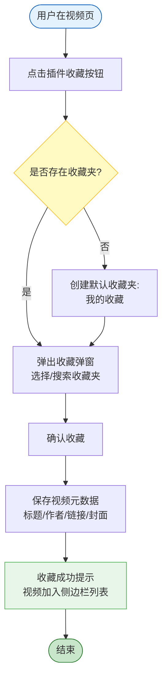

##### 10.2.1.2 页面交互

**收藏弹窗（视频页浮层）**

> 设计原则：有用 > 高效 > 容错 > 启发

**表单字段：**

| 字段名称 | 默认值 | 字段类型 | 必输项 | 备注 |
| --- | --- | --- | --- | --- |
| 收藏夹 | 最近使用的收藏夹 | 下拉选择 | 是 | 支持搜索和新建 |
| 标签 | 空 | 多选标签 | 否 | 可输入创建新标签 |
| 个人备注 | 空 | 多行文本 | 否 | 最多 500 字 |
| 重要标记 | 否 | 开关 | 否 | 标记为重要视频 |

**操作按钮：**

| 按钮名称 | 操作说明 | 触发条件 | 权限要求 |
| --- | --- | --- | --- |
| 确认收藏 | 保存视频到指定收藏夹 | 收藏夹已选择 | 所有用户 |
| 新建收藏夹 | 弹窗内快速创建收藏夹 | 点击"新建" | 所有用户 |
| 取消 | 关闭弹窗不保存 | 随时可点击 | 所有用户 |

**收藏夹管理页（独立Web端/插件弹窗）**

**列表字段：**

| 字段名称 | 字段类型 | 排序 | 操作 |
| --- | --- | --- | --- |
| 收藏夹名称 | 文本 | ✓ | 编辑、删除 |
| 视频数量 | 数字 | ✓ | — |
| 颜色标识 | 颜色块 | — | — |
| 创建时间 | 日期时间 | ✓ | — |
| 排序 | 拖拽手柄 | — | 拖拽调整顺序 |

**操作按钮：**

| 按钮名称 | 操作说明 | 触发条件 | 权限要求 |
| --- | --- | --- | --- |
| 新建收藏夹 | 创建新的收藏夹 | 点击按钮 | 所有用户 |
| 编辑 | 修改收藏夹名称和颜色 | 选中某收藏夹 | 所有用户 |
| 删除 | 删除收藏夹（视频移至默认夹） | 点击删除图标 | 所有用户；默认夹不可删 |
| 批量整理 | 批量移动视频到其他收藏夹 | 勾选视频后 | 所有用户 |

##### 10.2.1.3 业务规则

| 编号 | 规则类型 | 规则描述 |
| --- | --- | --- |
| R-COL-01 | 约束 | 同一用户不能重复收藏同一视频（以平台视频 ID 判重） |
| R-COL-02 | 约束 | 每个用户最多创建 50 个收藏夹；Pro 用户上限 200 个 |
| R-COL-03 | 约束 | 默认收藏夹"我的收藏"不可删除、不可重命名 |
| R-COL-04 | 触发条件 | 用户首次收藏时，系统自动创建默认收藏夹"我的收藏" |
| R-COL-05 | 触发条件 | 删除收藏夹时，该夹内所有视频自动迁移至默认收藏夹 |
| R-COL-06 | 计算 | 收藏夹视频数量 = 该夹下非删除状态的视频总数 |

---

#### 10.2.2 AI 知识提取功能详解

##### 10.2.2.1 业务流程

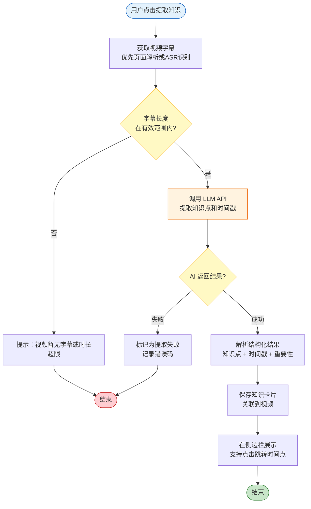

##### 10.2.2.2 页面交互

**知识提取面板（视频页侧边栏）**

**展示区域：**

| 区域 | 内容 | 交互 |
| --- | --- | --- |
| 提取按钮区 | "提取知识"主按钮 + 额度提示 | 点击触发提取；免费用户显示今日剩余次数 |
| 知识点列表 | 关键知识点卡片列表 | 点击卡片，视频跳转到对应时间戳 |
| 时间戳 | 知识点对应的视频时间点 | 格式 MM:SS，可点击跳转 |
| 重要性标识 | 1-5 星重要性评级 | 视觉区分核心概念和辅助信息 |
| 操作区 | 复制/编辑/删除知识点 | 用户可手动调整提取结果 |

**操作按钮：**

| 按钮名称 | 操作说明 | 触发条件 | 权限要求 |
| --- | --- | --- | --- |
| 提取知识 | 触发 AI 知识提取 | 视频未被提取过 或 用户主动重提 | 免费用户每日限 5 次 |
| 重新提取 | 以当前视频重新调用 AI | 提取已完成状态 | 消耗一次 AI 额度 |
| 编辑知识点 | 进入编辑模式修改内容 | 点击编辑图标 | 所有用户 |
| 删除知识点 | 删除单条知识点 | 点击删除图标 | 所有用户 |
| 生成摘要 | 基于提取结果生成全文摘要 | 提取成功状态 | 所有用户 |

##### 10.2.2.3 业务规则

| 编号 | 规则类型 | 规则描述 |
| --- | --- | --- |
| R-EXT-01 | 约束 | 仅支持提取时长 5-120 分钟的视频；超限时提示不支持 |
| R-EXT-02 | 约束 | 字幕文本最少 100 字，否则视为无效视频 |
| R-EXT-03 | 约束 | 同一视频 24 小时内最多重新提取 3 次 |
| R-EXT-04 | 触发条件 | 视频收藏成功后，若用户开启"自动提取"设置，自动触发知识提取 |
| R-EXT-05 | 触发条件 | AI 服务超时（60 秒无响应）自动标记为提取失败 |
| R-EXT-06 | 计算 | 知识点重要性 = LLM 输出置信度 × 关键词密度加权 |

##### AI 功能设计

> 确定性-容错性四象限分析 + 六脉神剑交互模式选择

**任务特征分析：**

| 分析维度 | 评估 |
| --- | --- |
| **确定性** | 中（视频内容多样，知识点边界模糊） |
| **容错性** | 高（提取结果可多可少，用户可手动增删） |
| **推荐交互模式** | **Copilot + 后台自动化** |

**AI 交互设计：**

- **交互模式**：后台自动化提取（用户点击后异步处理）+ Copilot 辅助（提取结果展示在侧边栏，用户可编辑修正）
- **人机边界**：
  - AI 执行：字幕解析、关键知识点识别、时间戳映射、重要性评级
  - 人必须参与：最终知识点的增删改、时间戳微调
  - 人可选择参与：对提取结果一键确认 或 逐条审核
- **降级方案**：AI 服务不可用时，提示用户"AI 服务暂时繁忙，请稍后重试"；对于已缓存字幕的视频，允许用户手动标记时间点并输入知识点
- **监控指标**：提取成功率（目标 ≥ 95%）、平均提取耗时（目标 < 20 秒）、用户编辑率（用于评估 AI 输出质量）

---

#### 10.2.3 AI 知识总结功能详解

##### 10.2.3.1 业务流程

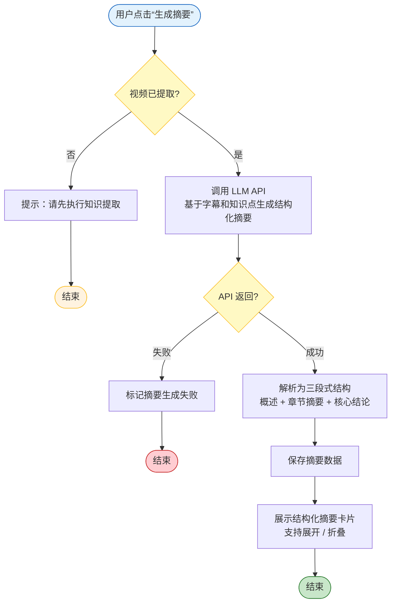

##### 10.2.3.2 页面交互

**摘要展示卡片**

**内容区域：**

| 区域 | 内容 | 交互 |
| --- | --- | --- |
| 视频概述 | 3-5 句话概括视频主旨 | 展开/折叠 |
| 章节摘要 | 按视频段落拆分的摘要列表 | 每章可展开查看详情 |
| 核心结论 | 视频传达的 3-5 条关键结论 | 一键复制 |
| 原文引用 | 摘要中引用的原文字段 | 点击跳转到视频对应时间点 |

**操作按钮：**

| 按钮名称 | 操作说明 | 触发条件 | 权限要求 |
| --- | --- | --- | --- |
| 生成摘要 | 触发 AI 摘要生成 | 视频已提取知识点 | 消耗 AI 额度 |
| 重新生成 | 重新调用 LLM 生成 | 已有摘要 | 消耗 AI 额度 |
| 复制全文 | 复制摘要 Markdown 文本 | 摘要已生成 | 所有用户 |
| 导出 Markdown | 下载为 .md 文件 | 摘要已生成 | Pro 用户 |

##### 10.2.3.3 业务规则

| 编号 | 规则类型 | 规则描述 |
| --- | --- | --- |
| R-SUM-01 | 约束 | 仅对已提取知识点的视频生成摘要 |
| R-SUM-02 | 约束 | 摘要生成结果最大 5000 字，超出部分截断 |
| R-SUM-03 | 约束 | 同一视频 24 小时内最多重新生成 2 次 |
| R-SUM-04 | 触发条件 | 知识提取成功后，若用户开启"自动生成摘要"，自动触发 |
| R-SUM-05 | 计算 | 章节数 = min(视频段落数, 8)，避免过度拆分 |

##### AI 功能设计

**任务特征分析：**

| 分析维度 | 评估 |
| --- | --- |
| **确定性** | 高（目标明确：生成三段式结构化摘要） |
| **容错性** | 中（摘要质量影响用户信任，但可重新生成） |
| **推荐交互模式** | **后台自动化 + 辅助填充** |

**AI 交互设计：**

- **交互模式**：后台自动化（异步生成）+ 辅助填充（结构化模板由 AI 自动填充）
- **人机边界**：
  - AI 执行：全文理解、段落拆分、摘要撰写、结论提炼
  - 人可选择参与：重新生成、复制导出
- **降级方案**：AI 服务不可用时，展示知识卡片中的原始知识点列表作为"精简版摘要"
- **监控指标**：摘要生成成功率（≥ 95%）、用户复制/导出率（衡量摘要价值感知）、重新生成率（衡量质量稳定性）

---

#### 10.2.4 思维导图生成功能详解

##### 10.2.4.1 业务流程

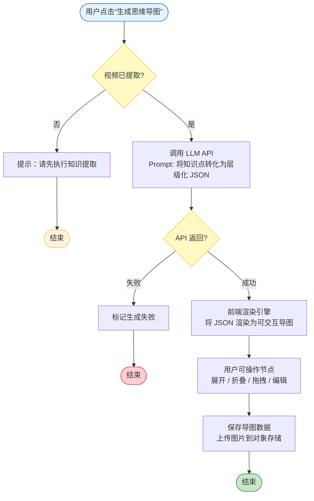

##### 10.2.4.2 页面交互

**思维导图查看器**

**交互区域：**

| 区域 | 内容 | 交互 |
| --- | --- | --- |
| 画布区 | 层级化节点网络图 | 支持缩放、平移、拖拽节点 |
| 节点 | 知识点文本 | 点击展开/折叠子节点；双击编辑文本 |
| 工具栏 | 导出/分享/重新生成/全屏 | 导出支持 PNG/SVG/Markdown |

**操作按钮：**

| 按钮名称 | 操作说明 | 触发条件 | 权限要求 |
| --- | --- | --- | --- |
| 生成导图 | 触发 AI 思维导图生成 | 视频已提取 | 免费用户限 3 次/日 |
| 重新生成 | 重新调用 LLM 生成 | 已有导图 | 消耗 AI 额度 |
| 编辑节点 | 进入节点编辑模式 | 双击节点 | 所有用户 |
| 添加节点 | 手动添加子节点 | 点击节点旁的"+" | 所有用户 |
| 删除节点 | 删除选中节点 | 选中后按 Delete 或点击删除 | 所有用户 |
| 导出 PNG | 导出为高清图片 | 导图已生成 | 所有用户 |
| 导出 SVG | 导出为矢量图 | 导图已生成 | Pro 用户 |
| 全屏查看 | 进入全屏沉浸模式 | 点击全屏按钮 | 所有用户 |

##### 10.2.4.3 业务规则

| 编号 | 规则类型 | 规则描述 |
| --- | --- | --- |
| R-MAP-01 | 约束 | 导图最大节点数 100 个，超出时提示"内容过多，建议拆分视频" |
| R-MAP-02 | 约束 | 导图层级深度最大 5 层，避免过度嵌套 |
| R-MAP-03 | 约束 | 同一视频 24 小时内最多重新生成 2 次 |
| R-MAP-04 | 触发条件 | 知识提取成功后，若用户开启"自动生成导图"，自动触发 |
| R-MAP-05 | 计算 | 节点布局采用树状布局算法，根节点为视频主题，一级节点为核心章节 |

##### AI 功能设计

**任务特征分析：**

| 分析维度 | 评估 |
| --- | --- |
| **确定性** | 高（输出格式为结构化 JSON， schema 固定） |
| **容错性** | 中（导图结构需合理，但用户可手动调整） |
| **推荐交互模式** | **后台自动化 + 辅助填充** |

**AI 交互设计：**

- **交互模式**：后台自动化生成 JSON 数据结构，前端渲染引擎实时可视化
- **人机边界**：
  - AI 执行：主题识别、层级划分、节点命名、关系建立
  - 人必须参与：最终结构的审阅和微调
- **降级方案**：AI 不可用时，基于知识卡片中的知识点列表，使用前端规则引擎生成基础层级结构（仅一层）
- **监控指标**：导图生成成功率（≥ 95%）、用户编辑率（评估 AI 结构质量）、导出分享率

---

#### 10.2.5 讲解动画生成功能详解

##### 10.2.5.1 业务流程

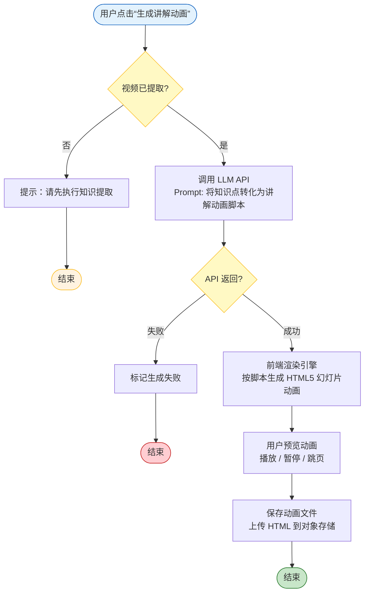

##### 10.2.5.2 页面交互

**讲解动画播放器**

**内容区域：**

| 区域 | 内容 | 交互 |
| --- | --- | --- |
| 幻灯片区 | 全屏 HTML5 动画页面 | 翻页动画、文字渐入、图表动态绘制 |
| 进度条 | 当前页码/总页码 | 点击跳转 |
| 播放控制 | 播放/暂停/重播 | 标准媒体控制 |
| 大纲区 | 幻灯片内容大纲 | 点击跳转到对应页 |
| 配音区 | [TODO: 未来可支持 AI 语音讲解] | — |

**操作按钮：**

| 按钮名称 | 操作说明 | 触发条件 | 权限要求 |
| --- | --- | --- | --- |
| 生成动画 | 触发讲解动画生成 | 视频已提取 | Pro 用户；免费用户限 1 次/周 |
| 重新生成 | 重新生成动画 | 已有动画 | Pro 用户 |
| 全屏播放 | 进入全屏播放模式 | 动画已生成 | 所有用户 |
| 分享链接 | 生成可分享的动画链接 | 动画已生成 | Pro 用户 |
| 导出 HTML | 下载离线 HTML 文件 | 动画已生成 | Pro 用户 |

##### 10.2.5.3 业务规则

| 编号 | 规则类型 | 规则描述 |
| --- | --- | --- |
| R-ANI-01 | 约束 | 动画最多 20 页幻灯片，避免过长 |
| R-ANI-02 | 约束 | 每页幻灯片内容字数限制 150 字以内 |
| R-ANI-03 | 约束 | 同一视频 7 天内最多重新生成 1 次（成本较高） |
| R-ANI-04 | 触发条件 | 动画文件生成后 30 天自动清理源文件，保留元数据和重新生成能力 |
| R-ANI-05 | 计算 | 幻灯片页数 = min(知识点数量 × 0.8, 20)，确保每页有实质内容 |

##### AI 功能设计

**任务特征分析：**

| 分析维度 | 评估 |
| --- | --- |
| **确定性** | 高（输出为固定格式的动画脚本 JSON） |
| **容错性** | 高（动画是增值功能，非核心路径） |
| **推荐交互模式** | **后台自动化** |

**AI 交互设计：**

- **交互模式**：纯后台自动化（用户点击后等待生成完成，结果以播放器形式呈现）
- **人机边界**：
  - AI 执行：脚本撰写、分页逻辑、动画效果指令生成
  - 人必须参与：播放和观看（无编辑能力，降低复杂度）
- **降级方案**：AI 不可用时，提示"动画生成服务维护中"，提供思维导图作为替代可视化方案
- **监控指标**：动画生成成功率（≥ 90%，因复杂度高略低于其他功能）、平均生成耗时（目标 < 60 秒）、播放完成率

---

#### 10.2.6 知识关联推荐功能详解

##### 10.2.6.1 业务流程

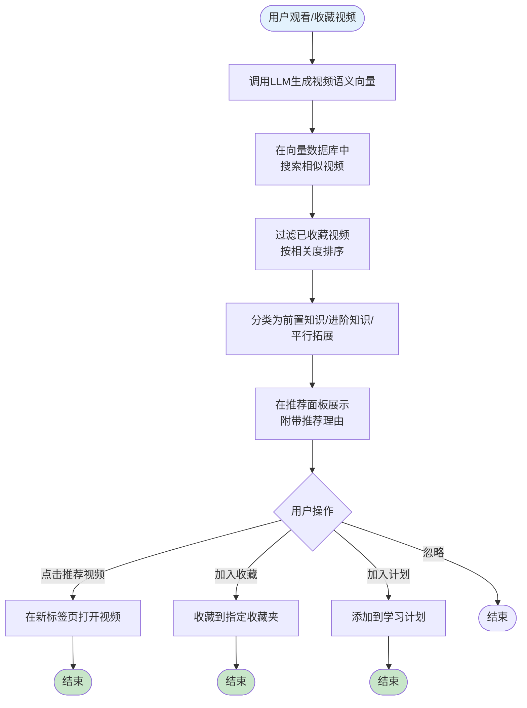

##### 10.2.6.2 页面交互

**推荐侧边栏（视频页）**

**展示区域：**

| 区域 | 内容 | 交互 |
| --- | --- | --- |
| 前置知识 | "在学这个之前，建议先了解..." | 视频卡片列表，显示标题、作者、预计学习时长 |
| 进阶知识 | "学完后可以继续深入..." | 同上 |
| 关联拓展 | "相关主题的其他视角..." | 同上 |
| 推荐理由 | 一句话说明为何推荐 | hover 显示详细匹配点 |

**操作按钮：**

| 按钮名称 | 操作说明 | 触发条件 | 权限要求 |
| --- | --- | --- | --- |
| 一键收藏 | 将推荐视频直接收藏 | 点击收藏图标 | 所有用户 |
| 加入计划 | 添加到当前活跃学习计划 | 点击"+"图标 | 所有用户 |
| 换一批 | 刷新推荐列表 | 点击刷新 | 免费用户每日限 5 次 |
| 不感兴趣 | 减少同类推荐 | 点击"×" | 所有用户 |

##### 10.2.6.3 业务规则

| 编号 | 规则类型 | 规则描述 |
| --- | --- | --- |
| R-REC-01 | 约束 | 推荐结果最多展示 9 条（每类 3 条） |
| R-REC-02 | 约束 | 已收藏视频不在推荐列表中重复出现 |
| R-REC-03 | 约束 | 被用户标记"不感兴趣"的视频 30 天内不再推荐 |
| R-REC-04 | 触发条件 | 用户收藏视频后，若开启"自动推荐"，自动刷新推荐面板 |
| R-REC-05 | 推论 | 若用户连续收藏同一主题视频 ≥3 个，增强该主题的推荐权重 |
| R-REC-06 | 计算 | 相关度评分 = 语义向量余弦相似度 × 0.6 + 主题标签匹配度 × 0.3 + 创作者权威性 × 0.1 |

---

#### 10.2.7 学习计划制定功能详解

##### 10.2.7.1 业务流程

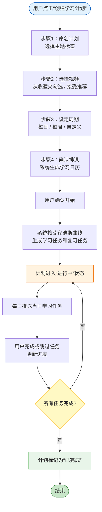

##### 10.2.7.2 页面交互

**计划创建向导**

**步骤1：基础信息**

| 字段名称 | 默认值 | 字段类型 | 必输项 | 备注 |
| --- | --- | --- | --- | --- |
| 计划名称 | "学习计划" + 日期 | 文本 | 是 | 最多 50 字 |
| 主题标签 | 空 | 多选标签 | 否 | 用于推荐关联视频 |
| 计划描述 | 空 | 多行文本 | 否 | 最多 200 字 |

**步骤2：选择视频**

| 字段名称 | 默认值 | 字段类型 | 备注 |
| --- | --- | --- | --- |
| 视频来源 | 我的收藏 | 单选 | 可选"我的收藏"或"推荐视频" |
| 已选视频 | 空 | 视频卡片列表 | 从收藏夹多选，最少 1 个，最多 50 个 |

**步骤3：设定周期**

| 字段名称 | 默认值 | 字段类型 | 备注 |
| --- | --- | --- | --- |
| 排课模式 | 每日固定量 | 单选 | 每日固定量 / 每周固定量 / 自定义日期 |
| 每日学习量 | 1 个视频 | 数字 | 每日需完成的新视频数 |
| 开始日期 | 明天 | 日期 | 最早为今天 |
| 结束日期 | 自动计算 | 日期（只读） | 根据视频总量和每日量自动计算 |

**步骤4：确认排课**

| 区域 | 内容 | 交互 |
| --- | --- | --- |
| 学习日历预览 | 以日历形式展示每日任务 | 可点击日期调整当日任务 |
| 复习任务说明 | 根据艾宾浩斯曲线，显示将在哪些日期触发复习 | 信息展示 |
| 确认按钮 | 开始执行计划 | 点击后计划激活 |

**学习日历/任务板（独立Web端）**

**列表字段：**

| 字段名称 | 字段类型 | 操作 |
| --- | --- | --- |
| 日期 | 日期 | — |
| 任务类型 | 标签（新学/复习） | — |
| 关联视频 | 视频标题链接 | 点击跳转 |
| 状态 | 标签（待完成/已完成/已跳过） | — |
| 操作 | 完成 / 跳过 / 重新学习 | 状态变更 |

**操作按钮：**

| 按钮名称 | 操作说明 | 触发条件 | 权限要求 |
| --- | --- | --- | --- |
| 开始计划 | 激活草稿计划 | 计划处于草稿状态 | 所有用户；最多 3 个活跃计划 |
| 暂停计划 | 暂停进行中计划 | 计划处于进行中 | 所有用户 |
| 恢复计划 | 恢复已暂停计划 | 计划处于已暂停 | 所有用户 |
| 完成任务 | 标记任务为已完成 | 任务处于待完成 | 所有用户 |
| 跳过任务 | 标记任务为已跳过 | 任务处于待完成 | 所有用户 |
| 调整排课 | 手动修改未来任务日期 | 计划进行中 | Pro 用户 |

##### 10.2.7.3 业务规则

| 编号 | 规则类型 | 规则描述 |
| --- | --- | --- |
| R-PLAN-01 | 约束 | 每个用户最多同时存在 3 个活跃计划（进行中状态） |
| R-PLAN-02 | 约束 | 单个计划最多包含 50 个视频 |
| R-PLAN-03 | 约束 | 计划的每日学习量范围 1-5 个视频 |
| R-PLAN-04 | 触发条件 | 计划开始后，系统每日 08:00 自动生成当日学习任务（含新学和复习） |
| R-PLAN-05 | 触发条件 | 用户连续 3 天未完成任务，系统自动发送"学习计划提醒"推送 |
| R-PLAN-06 | 触发条件 | 暂停超过 14 天的计划，系统自动标记为"已暂停（长期）"并发送恢复提示 |
| R-PLAN-07 | 计算 | 复习时间点 = 新学日期 + [1, 2, 4, 7, 15, 30] 天（艾宾浩斯遗忘曲线） |
| R-PLAN-08 | 计算 | 计划完成度 = 已完成任务数 / 总任务数 × 100% |

---

### 10.3 异常情况处理方案

| 异常类型 | 异常场景 | 处理方案 |
| --- | --- | --- |
| **网络异常** | 用户点击收藏/提取时断网 | 操作请求本地队列暂存，网络恢复后自动重试；超过 3 次失败提示用户手动重试 |
| **并发冲突** | 用户在多设备同时编辑同一收藏夹 | 乐观锁机制：以最后修改时间为准，后提交者收到"内容已更新"提示，需刷新后重试 |
| **数据异常** | 抖音精选页面结构改版，DOM 解析失败 | ① 解析层捕获异常，标记"页面适配中" ② 自动上报错误日志 ③ 向用户展示友好提示："抖音精选页面有更新，我们正在适配" |
| **误操作** | 用户误删收藏夹或知识点 | ① 收藏夹删除操作需二次确认 ② 支持撤销操作（5 秒内）③ 回收站保留已删数据 30 天 |
| **业务异常** | AI 服务返回低质量或违规内容 | ① 输出内容经过敏感词过滤层 ② 低置信度结果标注"AI 生成，建议核对" ③ 用户可一键反馈质量问题 |
| **服务降级** | 大模型 API 限流或超时 | ① 自动切换备用模型供应商 ② 免费用户优先降级，保障付费用户 ③ 超时请求进入异步队列，生成完成后推送通知 |
| **权限异常** | 用户浏览器阻止插件访问页面 | ① 引导用户检查权限设置 ② 提供图文安装教程 ③ 如权限无法获取，提示"部分功能受限" |
| **存储异常** | 用户本地存储空间不足 | ① 检测存储空间，不足时提示清理 ② 大文件（导图/动画）优先存储在云端，本地仅保留索引 |

---

## 11、数据埋点

### 11.1 埋点策略

- **埋点目标**：验证产品核心价值假设（用户是否愿意使用 AI 功能、是否愿意付费、收藏后回访率是否提升），同时为产品迭代提供用户行为数据支持。
- **埋点工具**：[TODO: 请确认统一埋点工具，如神策 / GrowingIO / Mixpanel / 自研]

### 11.2 页面埋点

| 页面名称 | 事件名称 | 事件类型 | 采集参数 | 用途说明 |
| --- | --- | --- | --- | --- |
| 视频页侧边栏 | page_view_sidebar | 页面曝光 | video_id, user_plan_type | 监控插件激活率 |
| 收藏夹管理页 | page_view_folder_mgmt | 页面曝光 | user_plan_type | 监控功能使用率 |
| 知识卡片详情页 | page_view_knowledge_card | 页面曝光 | video_id, extraction_status | 监控提取功能转化 |
| 摘要查看页 | page_view_summary | 页面曝光 | video_id, generation_source | 监控摘要功能使用 |
| 思维导图查看页 | page_view_mindmap | 页面曝光 | video_id, node_count | 监控导图功能使用 |
| 动画播放页 | page_view_animation | 页面曝光 | video_id, slide_count | 监控动画功能使用 |
| 学习日历页 | page_view_study_calendar | 页面曝光 | plan_id, active_plan_count | 监控学习计划使用率 |
| 独立Web首页 | page_view_web_home | 页面曝光 | referrer | 监控Web端流量来源 |

### 11.3 行为埋点

| 操作名称 | 事件名称 | 触发条件 | 采集参数 | 用途说明 |
| --- | --- | --- | --- | --- |
| 点击收藏 | btn_click_collect | 用户点击收藏按钮 | folder_id, video_duration | 监控收藏功能使用频率 |
| 完成知识提取 | flow_complete_extraction | 提取流程成功完成 | duration_sec, video_length, ai_model | 监控提取成功率和耗时 |
| 生成摘要 | btn_click_gen_summary | 用户点击生成摘要 | video_id | 监控摘要功能采纳率 |
| 生成思维导图 | btn_click_gen_mindmap | 用户点击生成导图 | video_id | 监控导图功能采纳率 |
| 生成讲解动画 | btn_click_gen_animation | 用户点击生成动画 | video_id | 监控动画功能采纳率（Pro指标） |
| 点击推荐视频 | btn_click_recommendation | 用户点击推荐视频 | recommend_type, target_video_id | 监控推荐点击率和分类效果 |
| 创建学习计划 | flow_complete_create_plan | 完成计划创建向导 | video_count, schedule_type, duration_days | 监控计划功能使用率 |
| 完成学习任务 | flow_complete_study_task | 用户标记任务完成 | task_type, plan_id, scheduled_date | 监控学习完成率 |
| 导出内容 | btn_click_export | 用户导出摘要/导图 | export_format, content_type | 监控导出功能使用 |
| 点击付费升级 | btn_click_upgrade | 用户点击升级Pro按钮 | source_page, trigger_feature | 监控付费转化漏斗 |
| 完成订阅支付 | flow_complete_payment | 支付流程成功 | plan_type, amount, payment_method | 监控付费转化率 |

### 11.4 业务指标埋点

| 指标名称 | 计算方式 | 数据来源 | 统计周期 |
| --- | --- | --- | --- |
| 插件日激活率 | 日活跃插件用户数 / 总安装用户数 | 页面曝光埋点 | 日 |
| 收藏转化率 | 收藏视频数 / 浏览视频页数 | 行为埋点 | 日 |
| AI 功能使用率 | 使用任一 AI 功能的用户数 / DAU | 行为埋点 | 周 |
| 七日回访率 | 收藏后 7 天内再次查看的用户数 / 总收藏用户数 | 行为埋点 + 业务表 | 周 |
| 付费转化率 | 付费用户数 / 注册用户数 | 行为埋点 | 月 |
| 学习任务完成率 | 已完成任务数 / 总任务数 | 业务表 | 周 |
| AI 平均生成耗时 | 所有 AI 生成操作的平均耗时 | 行为埋点 | 日 |
| 功能采纳率（漏斗） | 收藏 → 提取 → 摘要/导图 → 计划 | 行为埋点 | 周 |

---

## 12、角色和权限

> 方法论基础：RBAC 模型（用户→角色→权限集→功能）

### 12.1 角色定义

| 角色名称 | 角色说明 | 权限范围 |
| --- | --- | --- |
| **平台管理员** | 系统运维、用户管理、数据监控、费用配置 | 全部功能和数据 |
| **免费用户** | 注册但未付费的个人用户 | 基础收藏 + 有限 AI 功能 |
| **Pro 用户** | 付费订阅的个人用户 | 全部功能，无 AI 额度限制 |
| **[TODO: 企业版用户]** | [TODO: 如未来推出团队/企业版] | [TODO: 待定] |

### 12.2 功能权限差异

| 功能模块 | 具体功能 | 平台管理员 | 免费用户 | Pro 用户 |
| --- | --- | --- | --- | --- |
| **视频收藏管理** | 创建收藏夹 | ✓ | ✓（上限 50） | ✓（上限 200） |
| | 收藏视频 | ✓ | ✓ | ✓ |
| | 添加标签/备注 | ✓ | ✓ | ✓ |
| | 批量整理 | ✓ | ✓ | ✓ |
| **AI 知识提取** | 触发知识提取 | ✓ | ✓（限 5 次/日） | ✓（无限制） |
| | 编辑/删除知识点 | ✓ | ✓ | ✓ |
| **AI 知识总结** | 生成摘要 | ✓ | ✓（限 3 次/日） | ✓（无限制） |
| | 导出 Markdown | ✓ | — | ✓ |
| **思维导图生成** | 生成导图 | ✓ | ✓（限 3 次/日） | ✓（无限制） |
| | 导出 SVG | ✓ | — | ✓ |
| | 编辑节点 | ✓ | ✓ | ✓ |
| **讲解动画生成** | 生成动画 | ✓ | ✓（限 1 次/周） | ✓（无限制） |
| | 导出 HTML | ✓ | — | ✓ |
| | 分享动画链接 | ✓ | — | ✓ |
| **知识关联推荐** | 查看推荐 | ✓ | ✓ | ✓ |
| | 刷新推荐 | ✓ | ✓（限 5 次/日） | ✓（无限制） |
| | 不感兴趣反馈 | ✓ | ✓ | ✓ |
| **学习计划制定** | 创建计划 | ✓ | ✓（最多 1 个活跃） | ✓（最多 3 个活跃） |
| | 调整排课 | ✓ | — | ✓ |
| **知识图谱视图** | 查看图谱 | ✓ | — | ✓ |
| **用户系统** | 个人设置 | ✓ | ✓ | ✓ |
| | 订阅管理 | ✓ | ✓ | ✓ |
| | 查看用量统计 | ✓ | ✓ | ✓ |
| **平台管理** | 用户管理 | ✓ | — | — |
| | AI 额度配置 | ✓ | — | — |
| | 系统监控看板 | ✓ | — | — |

### 12.3 数据权限设计

| 角色 | 数据范围规则 | 说明 |
| --- | --- | --- |
| 平台管理员 | 全部用户数据（脱敏后） | 仅用于运维和数据分析，禁止查看用户私人笔记内容 |
| 免费用户 / Pro 用户 | 仅本人数据 | 用户的收藏、笔记、学习计划完全隔离，不可被其他用户查看 |
| 系统服务 | 按用户 ID 隔离访问 | 服务端通过用户认证 token 严格隔离数据查询范围 |

> **SaaS 多租户说明**：本产品采用 Row-level 租户隔离策略。所有业务表均包含 `user_id` 字段，API 网关层验证 JWT token 中的用户身份，数据库查询强制附加 `WHERE user_id = ?` 条件，确保数据隔离。

---

## 13、运营计划

> 方法论基础：SaaS 运营漏斗 — 获客→激活→留存→续费→扩展

### 13.1 上线发布计划

| 阶段 | 时间 | 范围 | 目标 | 回滚方案 |
| --- | --- | --- | --- | --- |
| 内测 | [TODO: 确定日期] | 内部团队 + 10 位亲友 | 插件安装/基础功能/API 稳定性验证 | 关闭服务入口 |
| 种子用户 | 内测后 2 周 | 50-100 位知识类 KOL 粉丝/学习社群成员 | 验证核心假设：用户是否愿为 AI 功能付费 | 暂停付费入口，改为全免费观察 |
| 公测 | 种子用户后 2 周 | Chrome 插件商店公开上架，限制每日注册 500 人 | 验证增长模型和服务器承载能力 | 关闭注册，仅保留现有用户 |
| 正式发布 | 公测后 1 个月 | 全量开放，启动付费推广 | 规模化获客 | 降级免费版功能，减少服务器压力 |

### 13.2 种子客户策略

- **目标种子客户画像**：22-30 岁一二线城市职场新人/大学生，每周在抖音精选/B站消费知识内容 ≥5 小时，已使用 Notion/飞书/幕布等工具做笔记，对效率工具有付费意愿。
- **种子客户数量**：100 人
- **合作方式**：免费获得 3 个月 Pro 版使用权，需每周填写使用反馈问卷，参与 1 次深度访谈。
- **核心验证点**：
  1. 用户是否愿意在安装插件后完成首次收藏和提取？
  2. 思维导图和摘要功能是否显著提升用户对收藏内容的回访率？
  3. 免费额度用完后，用户付费转化率是否 ≥ 3%？
  4. 学习计划功能是否帮助用户形成持续使用习惯？

### 13.3 客户成功体系

- **Onboarding 流程**：
  1. 安装后引导完成"第一次收藏"（提供热门知识视频推荐）
  2. 首次提取成功后展示"知识卡片"价值亮点
  3. 第 3 天推送"你已经收藏了 X 个视频，生成一张思维导图试试吧"
  4. 第 7 天推送"创建你的第一个学习计划，把收藏变成体系"
- **客服支持**：
  - 渠道：插件内反馈入口 + 微信公众号 + 邮件支持
  - 响应 SLA：工作日 24 小时内回复
  - 服务时间：工作日 9:00-21:00
- **续费策略**：
  - 到期前 7 天、3 天、1 天分别推送续费提醒
  - 年付用户续费享 8 折优惠
  - 连续订阅满 12 个月赠送 1 个月

### 13.4 推广计划

| 渠道 | 方式 | 目标 | 预算 |
| --- | --- | --- | --- |
| **Chrome 插件商店** | 优化关键词（抖音精选、知识管理、AI笔记）、获取早期好评 | 自然搜索流量，目标月安装 2000+ | 免费 |
| **学习类 KOL 合作** | 邀请 10-20 位知识区 UP主/博主体验并产出内容 | 精准触达目标用户，单篇内容引流 500+ | [TODO: 确定预算] |
| **学习社群渗透** | 在 Notion/飞书/ Obsidian 中文社群、考研/考公社群分享 | 获取早期种子用户 | 免费 |
| **内容营销** | 官方账号输出"知识管理方法论"系列文章/视频 | 建立品牌专业度，SEO 引流 | [TODO: 确定预算] |
| **产品猎人平台** | 上架 Product Hunt / 小众软件 / V2EX 等 | 获取早期 adopter 和反馈 | 免费 |

### 13.5 需求收集与迭代

- **需求收集渠道**：
  - 插件内"反馈"入口（最高优先级）
  - 种子用户微信群/飞书群
  - 应用商店评论监控
  - 客服工单分类统计
- **迭代节奏**：
  - 双周迭代：修复 Bug、小幅体验优化
  - 月度迭代：新功能上线（按优先级队列）
  - 季度规划：大版本方向调整（基于数据复盘）

---

## 14、待决事项

| 编号 | 待决事项 | 涉及章节 | 负责人 | 预计决策时间 | 当前状态 |
| --- | --- | --- | --- | --- | --- |
| TBD-1 | 确定产品正式名称（当前为 "ReelMind"） | 全文 | [TODO] | [TODO] | 已确定 |
| TBD-2 | 确定 AI 大模型供应商及 API 成本预算 | 3.4, 6.1, 7.3 | [TODO] | [TODO] | 待讨论 |
| TBD-3 | 确定付费定价策略和会员权益边界（免费 vs Pro 的具体功能切割） | 3.4, 5.3, 12.2 | [TODO] | [TODO] | 待讨论 |
| TBD-4 | 确定埋点工具和数据平台方案 | 11.1 | [TODO] | [TODO] | 待讨论 |
| TBD-5 | 确认是否需与抖音精选官方沟通合作或合规事宜 | 6.1, 7.3 | [TODO] | [TODO] | 待讨论 |
| TBD-6 | 确定支付方式（微信/支付宝/Stripe）和订阅系统方案 | 6.1, 13.3 | [TODO] | [TODO] | 待讨论 |
| TBD-7 | 确认 PRD 审核人和正式发布流程 | 头部信息 | [TODO] | [TODO] | 待讨论 |
| TBD-8 | 确定上线各阶段的具体日期 | 13.1 | [TODO] | [TODO] | 待讨论 |
| TBD-9 | [TODO: 补充 KOL 合作预算和推广预算] | 13.4 | [TODO] | [TODO] | 待讨论 |

> 当前待决事项共 9 项，在 10 项警戒线以内。建议优先解决 TBD-2（AI 供应商）、TBD-3（定价策略）、TBD-5（平台合规）三项，它们直接影响技术架构和商业可行性。

---

## 附：待完善清单

### 第一步：重大风险项快扫

| 风险项 | 检查内容 | 状态 |
| --- | --- | --- |
| **R1 产品定位** | 能否用一句话回答"为谁、解决什么问题、提供什么价值" | 已覆盖（第1章1.3节） |
| **R2 核心业务流程** | 能否从 PRD 中重建端到端的业务流程 | 已覆盖（第10.1.3流程图 + 第10.2各模块流程） |
| **R3 ER 模型缺陷** | 工具型产品的数据模型是否支撑核心功能 | 已覆盖（第10.1.2 ER 图含 10 个核心实体） |
| **R4 角色权限** | 多角色系统是否有权限设计 | 已覆盖（第12章权限矩阵） |
| **R5 功能致命缺口** | 核心业务流程是否有断裂的环节 | 已覆盖（收藏→提取→总结→可视化→推荐→规划闭环完整） |
| **R6 需求与业务脱节** | 功能设计是否匹配实际业务场景 | 已覆盖（第2章三个场景与第10章功能一一对应） |
| **R7 合规风险** | 是否考虑了数据隐私和平台合规要求 | 已覆盖（第6.1、7.3提到个保法、平台规则、不下载视频） |
| **R8 SaaS 多租户** | 商业化 SaaS 是否有租户隔离设计 | 已覆盖（第12.3 Row-level 隔离） |

### 第二步：14 维度快速扫描

| 维度 | 对应章节 | 完成度评估 | 需补充内容 |
| --- | --- | --- | --- |
| 01 业务分析质量 | 第1章 | 80% | 缺少抖音精选平台的具体用户数据（日活、知识类视频占比、收藏回访率等） |
| 02 产品类型适配性 | Phase 0 | 100% | 已按商业化产品 × 工具型调整各章节侧重 |
| 03 产品定位合理性 | 第3-4章 | 85% | 市场规模 TAM/SAM/SOM 数据待补充；定价策略待确认 |
| 04 场景分析与用户旅程 | 第2章 | 90% | 3 个核心场景完整，可补充更多边缘场景（如批量操作、跨设备同步） |
| 05 文档结构完整性 | 全文 | 100% | 1-14 章全部覆盖 |
| 06 架构设计质量 | 第10.1章 | 90% | 架构图完整，但技术选型细节（前端框架、数据库选型）待补充 |
| 07 数据建模质量 | 第10.1.2章 | 90% | ER 模型完整，索引设计和分表策略待技术评审补充 |
| 08 流程与角色设计 | 第10+12章 | 95% | 权限矩阵较完整，[TODO] 企业版角色为占位符 |
| 09 交互设计质量 | 第10.2章 | 85% | 核心页面已覆盖，可补充空状态、加载态、错误态的交互细节 |
| 10 商业分析深度 | 第3章 | 80% | 竞品分析完整，但缺少一手调研数据（如用户访谈结论） |
| 11 MVP 策略与演进 | 第5.3章 | 90% | MVP 范围清晰，验证假设明确，各阶段时间点待确认 |
| 12 异常处理与健壮性 | 第10.3章 | 90% | 8 类异常已覆盖，可补充 AI 内容安全审核的具体规则 |
| 13 AI 功能设计质量 | 第10章 | 95% | 四象限 + 六脉神剑分析完整，各模块有人机边界定义 |
| 14 运营方案与效果跟踪 | 第11+13章 | 85% | 埋点方案完整，推广预算和 KOL 名单待补充 |

### 第三步：按优先级排序的待完善清单

#### 必须补充（影响 PRD 可评审性）

1. **确定 AI 大模型供应商和 API 成本预算**（涉及第3.4、6.1、7.3章）
   - 为什么重要：直接影响技术方案可行性、定价策略和商业模式健康度。
   - 建议：评估 OpenAI / Claude / 文心一言 / 通义千问等供应商的中文视频理解能力和价格，计算单次提取/摘要/导图的平均成本。

2. **确定付费定价策略和免费/Pro 功能切割**（涉及第3.4、5.3、12.2章）
   - 为什么重要：商业化产品的核心变量，决定 LTV/CAC 模型是否成立。
   - 建议：参考 Readwise（$7.99/月）、Notion AI（$10/月）等竞品定价，结合国内用户付费习惯，确定月费/年费档位。

3. **确认抖音精选平台合规边界**（涉及第6.1、7.3章）
   - 为什么重要：第三方插件最大的生存风险，需在产品开发前明确法律和技术边界。
   - 建议：咨询法务团队，确认 DOM 解析、字幕获取、品牌使用是否合规；同时准备 B 方案（独立 Web 应用）。

#### 建议补充（提升 PRD 质量）

4. **补充市场规模数据**（涉及第3.1章）
   - 建议：引用易观/艾瑞/QuestMobile 报告中关于知识付费用户规模、在线学习工具市场的数据。

5. **补充核心页面空状态和错误状态设计**（涉及第10.2章）
   - 建议：为每个核心页面补充"无数据时"、"AI 生成失败时"、"网络中断时"的交互状态。

6. **确定上线各阶段具体日期和里程碑**（涉及第13.1章）
   - 建议：结合开发资源评估，确定内测→种子用户→公测→正式发布的时间线。

7. **补充推广预算和种子 KOL 名单**（涉及第13.4章）
   - 建议：列出 10-20 位潜在合作的知识区 KOL，评估合作方式和预算。

#### 可选完善（锦上添花）

8. **补充产品正式名称和品牌定位语**
   - 当前产品名已确定为 ReelMind。

9. **补充跨设备同步的技术方案细节**
   - 用户可能在 PC 收藏、移动端回顾，需明确多端数据同步机制。

10. **补充 AI 输出内容的安全审核规则**
    - 明确对涉政、涉黄、错误知识等违规内容的过滤策略。

---

> 建议：优先补充 必须补充 类内容后，可使用 `/check-prd` 对完善后的 PRD 进行完整评审。
